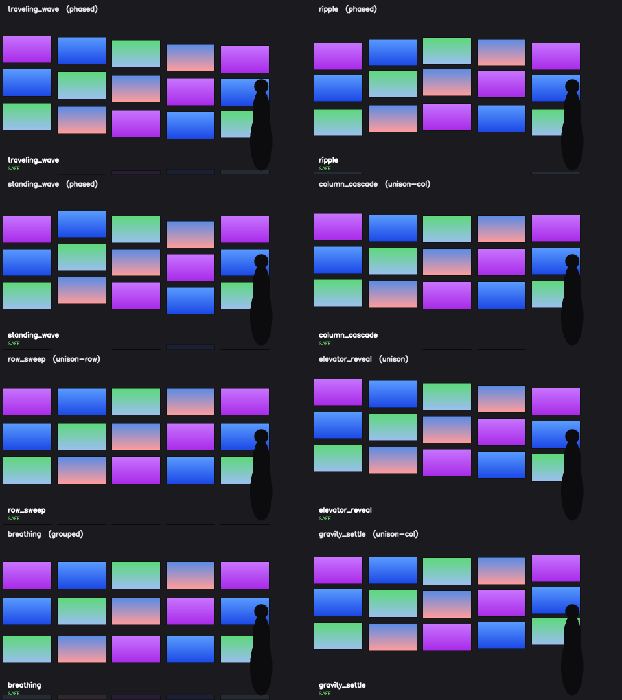

# Kinetic Monitor Pre-vis

An AI-assisted workspace for prototyping motion on a 5×3 kinetic monitor wall before physical production.


<sub>Frame from the final motion-design pass of the included sports-tech concept. Client and partner identifiers are intentionally excluded from this public snapshot.</sub>

## The problem

A kinetic installation is expensive to build and slow to pitch with hand-made motion studies. This project shortens the first exploration loop: turn a structured brief into a reviewable concept, render it, inspect the result, and iterate before a motion designer or hardware team invests in a production file.

The repository is a public, anonymized R&D snapshot, built for a specific company as an internal tool of future frequent use. It demonstrates the workflow and constraints without publishing partner-specific assets or operating material.

## What works today

- A brief schema and worked sports-tech example.
- A constraint-driven design system for a 15-monitor wall.
- Agent commands for brief intake, rendering, visual critique, preview, and packaging.
- Eight Python motion primitives with a fast OpenCV diagnostic renderer.
- Four **hand-authored example choreographies** that show how primitives and content events can be represented as data.
- A browser preview and capture path for the higher-fidelity HTML concept.
- A sampled collision check for vertically adjacent tiles in the Python motion lab.

This is not yet a general text-to-choreography product. The included choreographies are authored examples; their data shape is suitable for future model-generated sequences, but arbitrary-brief generation is not implemented in `motion-lab/compose.py`.

## Workflow

1. `/concept` turns an idea into a structured brief.
2. `/render` maps the brief to a monitor layout and creates an HTML motion concept.
3. `/preview` captures the loop and makes visual defects inspectable.
4. A design critic scores the rendered result against a 30-point rubric.
5. `/ship` packages an approved concept for review and handoff.

The repository deliberately keeps the fast agentic workflow used during the experiment. Within this project directory, the agent can edit and run tools; a stop hook may create a **local concept-only commit** after a critique reaches 24/30. It does not push or publish. That narrow boundary made rapid iteration possible while preserving a human review point before anything leaves the local repository.

## Motion lab

`motion-lab/` separates motion logic from the presentation layer. Each primitive is a pure function:

```python
dy(col, row, t, amplitude) -> vertical_offset
```

The composer crossfades between primitives and synchronizes simple content events such as highlight pulses, color shifts, and text reveals.

| Primitive | Intended feel |
|---|---|
| `traveling_wave` | diagonal travelling sine |
| `ripple` | rings expanding from the centre |
| `standing_wave` | fixed nodes and moving antinodes |
| `column_cascade` | left-to-right column sweep |
| `row_sweep` | top-to-bottom row sweep |
| `elevator_reveal` | wall-wide rise and return |
| `breathing` | upper and lower groups moving apart |
| `gravity_settle` | staggered drop and fast reset |



<sub>OpenCV diagnostic output. “SAFE” means no overlap was found for vertically adjacent tiles at 60 evenly spaced samples over the normalized loop; it is not a continuous-time proof or a hardware certification.</sub>

## Run it

Python 3.11+ is recommended.

```sh
python3 -m venv .venv
source .venv/bin/activate
python3 -m pip install -r motion-lab/requirements.txt

python3 motion-lab/generate.py motion-lab/out
python3 motion-lab/compose.py motion-lab/out
python3 -m unittest discover -s motion-lab/tests -v
```

To open the HTML concept:

```sh
cd preview
npm install
npm run dev
# http://localhost:4173/preview/index.html?concept=_example-sports-tech
```

## Repository map

```text
design-system/              geometry, motion rules, tokens, and review rubric
motion-lab/                 Python primitives, composer, preview, tests, and export bridge
.claude/                    agent commands, specialist roles, and bounded local hooks
briefs/                     brief template and anonymized worked example
concepts/                   generated concept specification, artifact, and assets
prompts/                    templates used by the render workflow
preview/                    static concept viewer and browser capture helper
scripts/                    asset and video-render utilities
```

## Validation and limits

- `collision_safe()` samples 60 instants by default and checks **vertical neighbours only**. It can detect overlap in those samples; it does not prove continuous-time safety.
- The HTML concept includes detach and zoom transitions that are reviewed visually against the design contract. The public snapshot does not contain a full path-planning or hardware-safety simulator.
- The OpenCV renderer is a fast diagnostic view, not the final visual output.
- `gravity_settle` uses a deliberately fast reset and is not visually seamless.
- No motor control, load modelling, emergency-stop logic, or physical rig integration is included. Hardware validation remains a separate engineering responsibility.

## My contribution

I defined the exploration workflow, encoded the motion and review constraints, implemented the Python motion lab and browser prototype, and used AI coding and visual-generation tools to accelerate iteration. The design rubric, orchestration boundaries, implementation decisions, testing, and final selection remained human-directed.

## Status

R&D prototype. The next technical step would be a validated brief-to-choreography planner with continuous-path collision checks, followed by integration with a production motion-design workflow.
